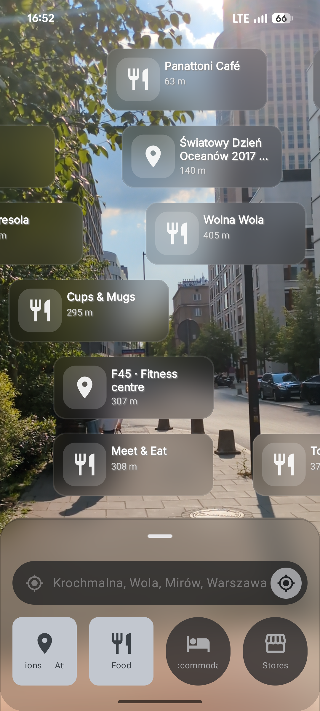
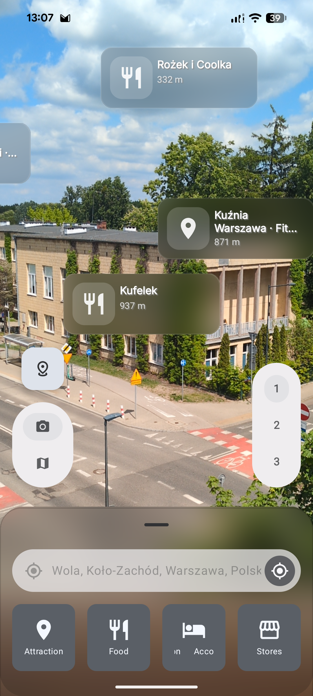
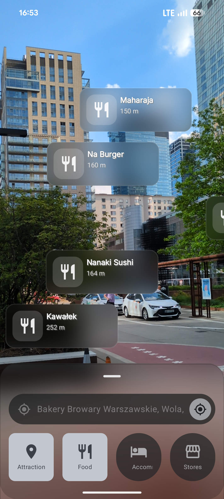
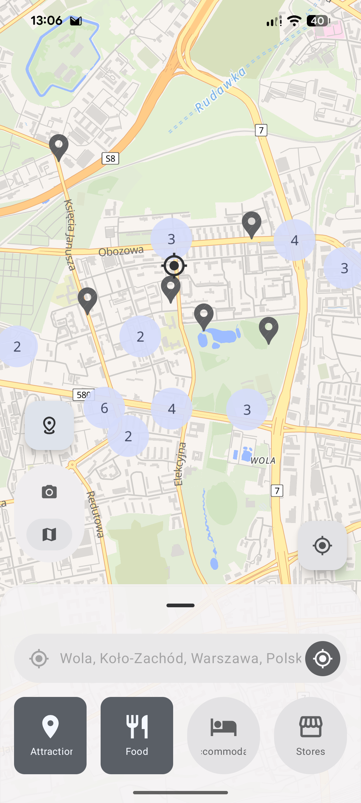
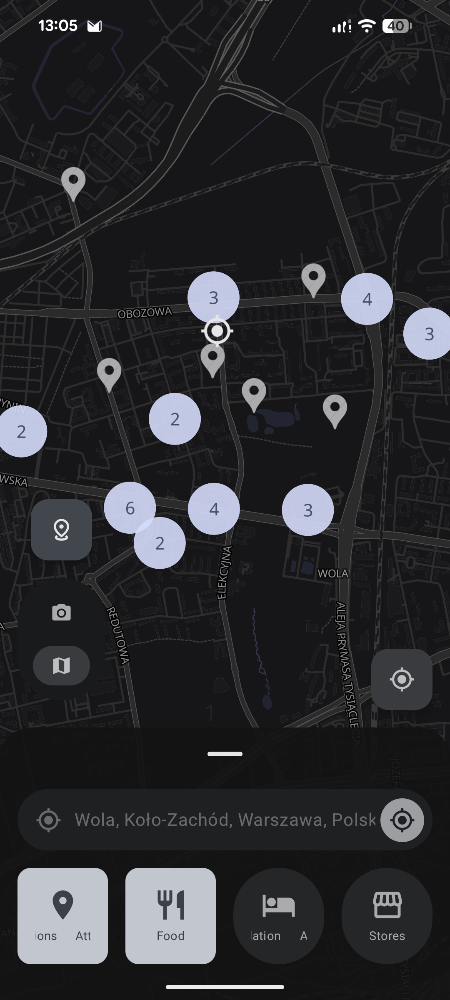
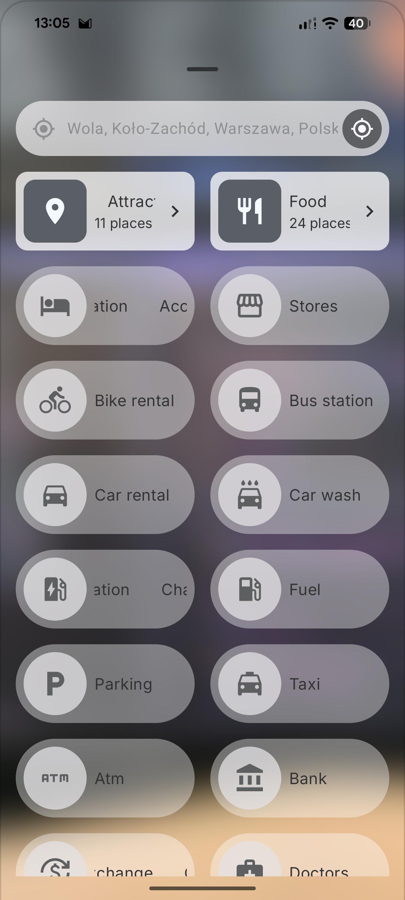
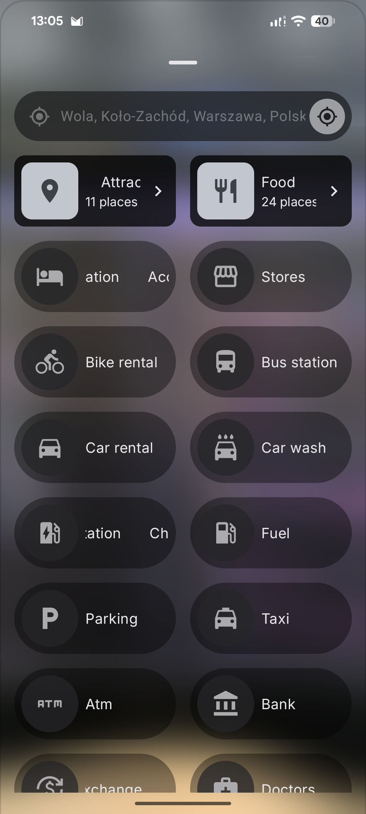

  

## About
**_Sightline_** is a **location-based AR** (augmented reality) Android app utilizing **camera and map** previews.

    
Table of Contents

    <ol>
        <li><a href="#screenshots">Screenshots</a></li>
        <li><a href="#features">Features</a></li>
        <li><a href="#used-technologies">Used technologies</a></li>
    </ol>

## Screenshots

## Features
- **Augmented reality camera** preview
- **Map** preview
- Category-based **place search**
- User **location tracking**
- Automatic **address lookup** (geocoding)
- Manual address entry

## Used technologies
- [Jetpack Compose](https://developer.android.com/compose) - declarative UI toolkit
- [Navigation 3](https://developer.android.com/guide/navigation/navigation3) - screen flows definition, backstack management
- [CameraX](https://developer.android.com/jetpack/androidx/releases/camera) - camera preview for augmented reality
- [OpenGL ES 3.0 / JNI](https://developer.android.com/guide/topics/graphics/opengl) - high-performance camera texture rendering with Gaussian blur and color overlay effects via native C++
- [MapLibre Compose](https://github.com/maplibre/maplibre-compose) - map rendering
- [Hilt](https://dagger.dev/hilt/) - dependency injection
- [Retrofit](https://square.github.io/retrofit/) - network requests (Overpass & Photon APIs)
- [Moshi](https://github.com/square/moshi) - JSON serialization/deserialization
- [Datastore](https://developer.android.com/jetpack/androidx/releases/datastore) - user preference storage (with Protobuf)
- [Coroutines](https://kotlinlang.org/docs/coroutines-guide.html) - asynchronous/concurrent programming
- [Play Services Location](https://developers.google.com/android/reference/com/google/android/gms/location/package-summary) - user location tracking
